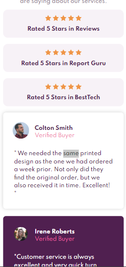

# Frontend Mentor - Social proof section solution

- Live Site URL: [View the live site here](https://Iamronaldosunmu.github.io/social-proof-section)


This is a solution to the [Social proof section challenge on Frontend Mentor](https://www.frontendmentor.io/challenges/social-proof-section-6e0qTv_bA). Frontend Mentor challenges help you improve your coding skills by building realistic projects. 

## Table of contents

- [Frontend Mentor - Social proof section solution](#frontend-mentor---social-proof-section-solution)
  - [Table of contents](#table-of-contents)
  - [Overview](#overview)
    - [The challenge](#the-challenge)
    - [Screenshot](#screenshot)
    - [Links](#links)
  - [My process](#my-process)
    - [Built with](#built-with)
    - [What I learned](#what-i-learned)
    - [Continued development](#continued-development)
    - [Useful resources](#useful-resources)
  - [Author](#author)


## Overview

### The challenge

Users should be able to:

- View the optimal layout for the section depending on their device's screen size

### Screenshot



This is a screenshot of my solution, it was very long so I had to crop it.


### Links

- Live Site URL: [View the live site here](https://Iamronaldosunmu.github.io/social-proof-section)

## My process
Built this website using the bottoms up approach- Built the components then assembled them for the final product. I also used the BEM system of naming classes.
### Built with

- Semantic HTML5 markup
- CSS custom properties
- Flexbox
- CSS Grid


### What I learned

I solidified my understanding of handling complex css layouts. It was also fun to use the css flex attribute once again.

```html
<h1>Some HTML code I'm proud of</h1>
```
```css
.proud-of-this-css {
  color: papayawhip;
}
```
```js
const proudOfThisFunc = () => {
  console.log('🎉')
}
```

### Continued development

I am currently learning User Interface design with Adobe XD so that I'll be able to make the designs I use in my projects from scratch. After that, I'll be learning React.js and React Native.
### Useful resources

- [The Ultimate Html and Css Course By mosh Hamedani](https://www.codewithmosh.com) - This taught me most of what I know in html and css (at the time of building this project).


## Author

- Twitter - [@IamRonald05](https://www.twitter.com/IamRonald05)


